# LuLu_3.1.5版本已经自带中文，大家更新即可，谢谢

#LuLu Mac防火墙 中文汉化包

这是 [LuLu](https://github.com/objective-see/LuLu) 的中文（简体）汉化包。

原版项目地址：https://github.com/objective-see/LuLu

## 关于 LuLu

LuLu 是 macOS 平台上的免费开源防火墙软件，由 Objective-See 开发。

### 安装位置
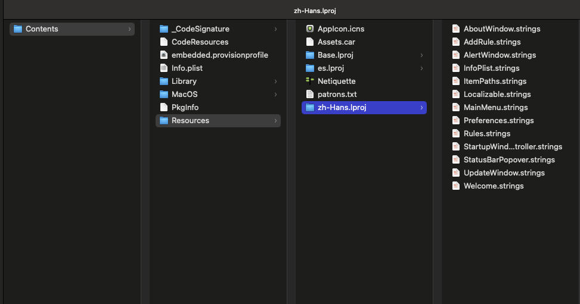

## 汉化效果
### 主界面对比
| 英文 | 中文 |
|------|------|
| 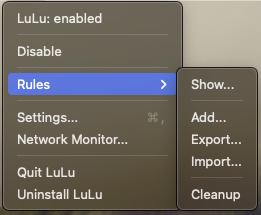 | 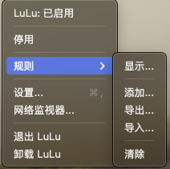 |

### 设置界面1对比
| 英文 | 中文 |
|------|------|
| 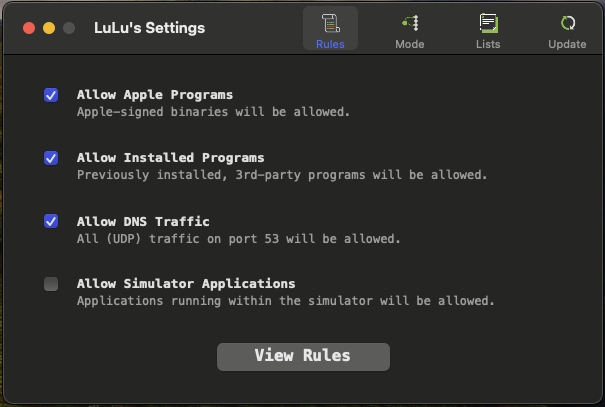 | 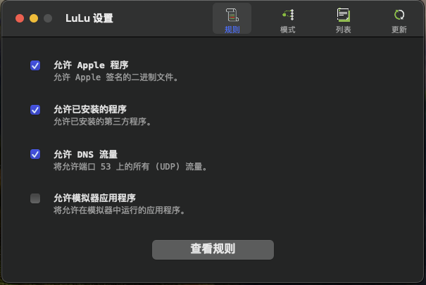 |

### 设置界面2对比
| 英文 | 中文 |
|------|------|
| 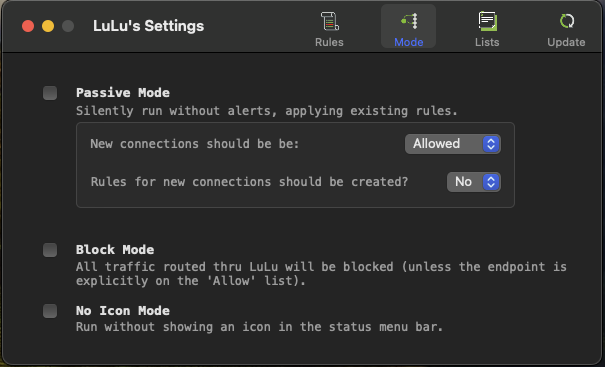 | 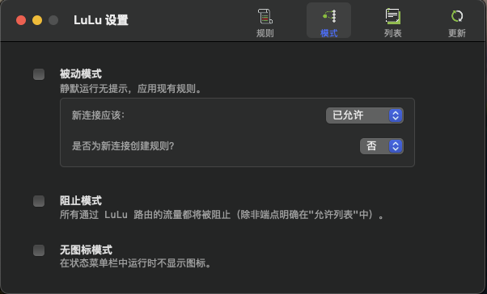 |

### 设置界面3对比
| 英文 | 中文 |
|------|------|
| 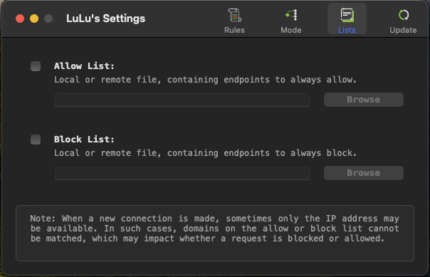 | 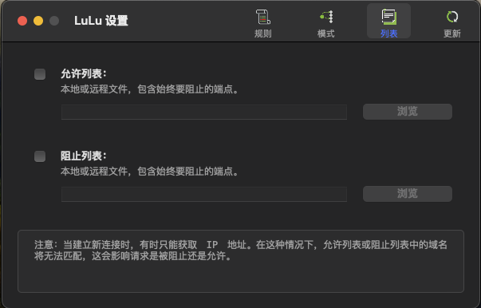 |

### 设置界面4对比
| 英文 | 中文 |
|------|------|
| 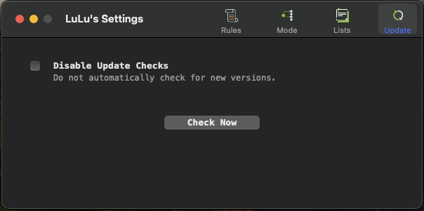 | 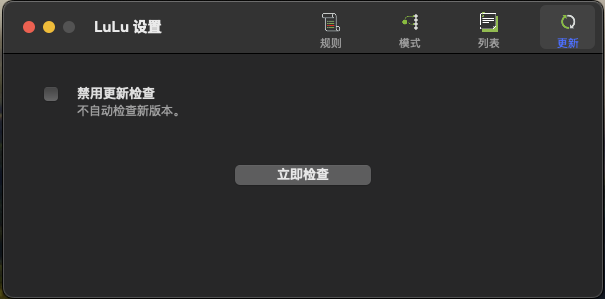 |

### 退出界面对比
| 英文 | 中文 |
|------|------|
|  | 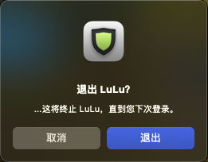 |

## 本地化文件说明

本仓库包含了 LuLu 的简体中文翻译文件，位于 `zh-Hans.lproj` 目录下。

## 使用方法

使用步骤：
1. 确保已安装 [LuLu 3.0.0 版本](https://github.com/objective-see/LuLu/releases/tag/v3.0.0) 并能正常运行
2. 退出 LuLu 应用程序
3. 下载本仓库中的 `zh-Hans.lproj` 文件夹
4. 找到已安装的 LuLu 应用程序（通常在应用程序目录下）
5. 右键点击 LuLu 应用程序，选择"显示包内容"
6. 进入 `Contents/Resources/` 目录
7. 将下载的 `zh-Hans.lproj` 文件夹复制到该目录下
8. 启动 LuLu 应用程序

注意：此汉化包仅适用于 LuLu 3.0.0 版本，如果重新安装了应用程序，需要重新执行上述步骤。

能力有限，如有翻译不当之处，欢迎指正！

## 许可证

本项目采用与原项目相同的开源协议。
转载或使用本项目内容时请注明出处，谢谢！

